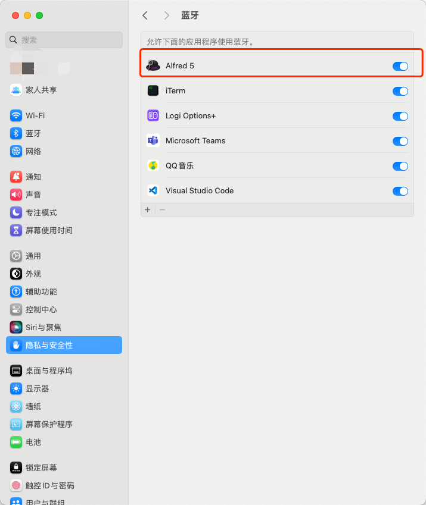
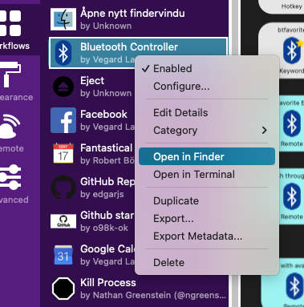
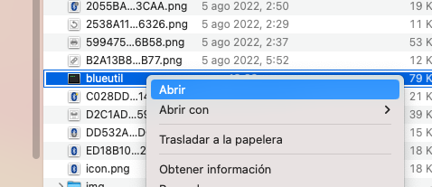

# Alfred Workflow: Bluetooth Controller <!-- omit in toc -->

A powerful toolkit for managing your bluetooth connections. Includes Remote Trigger, to manage your Bluetooth devices on
the big screen.

## Contents <!-- omit in toc -->

- [Installation](#installation)
- [Usage](#usage)
  - [Commands](#commands)
    - [Manage bluetooth status](#manage-bluetooth-status)
    - [Toggle Device Connections](#toggle-device-connections)
    - [Manage favorite device](#manage-favorite-device)
    - [Pair/Unpair Device](#pairunpair-device)
    - [Large-Type Bluetooth Status](#large-type-bluetooth-status)
  - [Safe Mode](#safe-mode)
  - [Remote triggers](#remote-triggers)
- [Troubleshooting](#troubleshooting)
  - [Allow Alfred to control bluetooth](#allow-alfred-to-control-bluetooth)
  - [Remove quarantine using terminal](#remove-quarantine-using-terminal)
  - [Install Command Line Tools](#install-command-line-tools)
- [Installation images](#installation-images)
- [Screenshots](#screenshots)
- [Attribution](#attribution)

---

## Installation

1. Download the [Alfred workflow](https://github.com/vegardinho/alfred_bluetooth_controller/releases/latest) and
   double-click to install.
2. Allow `blueutil` and `notificator` to run (remove the quarantine attribute from the bundled binary).
   1. Open workflow folder in Finder by right clicking workflow ([see image](#installation-images)).
   2. Right-click on `blueutil` and click 'open' ([see image](#installation-images)).
   3. Confirm open when dialog appears.
   4. Repeat with `notificator` file.
   5. This can alternatively be done [using the terminal](#remove-quarantine-using-terminal).
3. [Allow Alfred to control bluetooth](#allow-alfred-to-control-bluetooth).
4. Enjoy!

---

## Usage

### Commands

#### Manage bluetooth status

- Turn bluetooth on: `bton`
- Turn bluetooth off: `btoff`
- Toggle bluetooth status: `bttoggle`
- Reset (disable, wait 1.5 seconds, enable: `btreset`

#### Toggle Device Connections

- Connect/disconnect from device: `btd` + `device name`

#### Manage favorite device

- Set favorite device: `btsetfavorite` + `device name`
- Toggle connection with favorite device:
  - with hotkey: `cmd-ctr-option-f`
  - with keyword: `btfavorite`
- Remove device as favorite:
  - `btd` + `device name` + press modifier key `shift`
  - `btsetfavorite` + `device name` + press modifier key `shift`

#### Pair/Unpair Device

- Pair:
  - `btp` + `device name`
  - Wait 5 seconds for results to show up.
- Unpair:
  - `btd` + `device name` + press modifier key `cmd`

#### Large-Type Bluetooth Status

- See status of bluetooth connection and paired devices.
- `btstatus`

### Safe Mode

Set environment variable `confirm` in workflow to `true` if you want to force user confirmation on toggle and
deactivation commands. (Useful for iMacs and Mac Minis who that would have trouble turning Bluetooth on again without
any input devices.)

### Remote triggers

Most, or all, the listed commands have their own Remote Trigger. (You're welcome to add ones that are missing.)

---

## Troubleshooting

If the workflow is not working as expected, try the following:

### Allow Alfred to control bluetooth

Go to `System Preferences -> Privacy & Security -> Bluetooth` and add the Alfred version you are using (in this case, Alfred 5). If you have already added Alfred, ensure it is turned on. 

### Remove quarantine using terminal

Use the following command once in directory:

- Blueutil: `xattr -d com.apple.quarantine ./blueutil`
- Notificator: `xattr -d com.apple.quarantine ./notificator` 
  

### Install Command Line Tools

If you experience the error `xcrun: error: invalid active developer path`, Command Line Tools is likely not installed properly. More info, as well as instructions on how to install it, can be found here: https://apple.stackexchange.com/a/254381

---

## Installation images

---

## Screenshots

---

## Attribution

- [blueutil](https://github.com/toy/blueutil) binary is used for bluetooth functionality.
- [notificator](https://github.com/vitorgalvao/notificator) binary is used for notifications.
