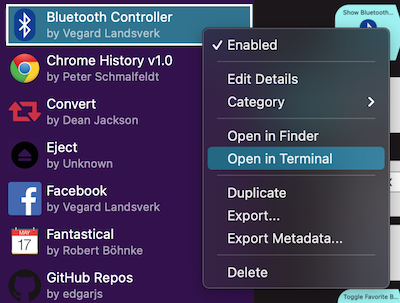
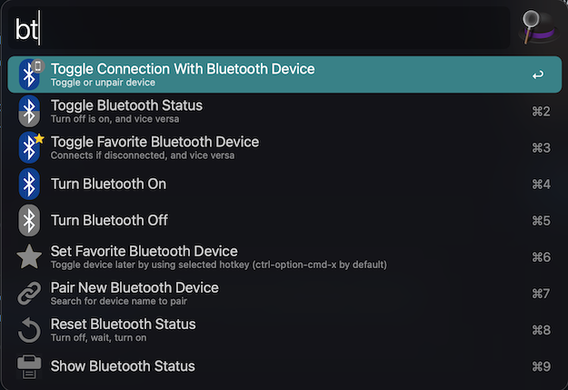
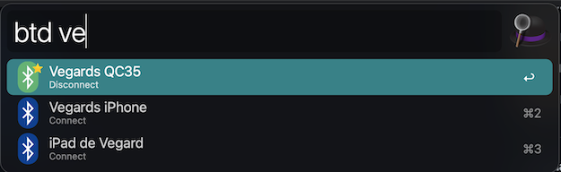

# Alfred Workflow: Bluetooth Controller <!-- omit in toc -->

A powerful toolkit for managing your bluetooth connections. Includes Remote Trigger, to manage your Bluetooth devices on
the big screen.

## Contents <!-- omit in toc -->

- [Installation](#installation)
- [Usage](#usage)
  - [Commands](#commands)
    - [Manage bluetooth status](#manage-bluetooth-status)
    - [Toggle Device Connections](#toggle-device-connections)
    - [Manage favorite device](#manage-favorite-device)
    - [Pair/Unpair Device](#pairunpair-device)
    - [Large-Type Bluetooth Status](#large-type-bluetooth-status)
  - [Safe Mode](#safe-mode)
  - [Remote triggers](#remote-triggers)
- [Troubleshooting](#troubleshooting)
- [Attribution](#attribution)
- [Screenshots](#screenshots)

---

## Installation

Download the [Alfred workflow](https://github.com/vegardinho/alfred_bluetooth_controller/releases/latest) and
double-click to install! If you encounter issues related to the blueutil or notificator scripts,
see the [troubleshooting section](#troubleshooting).

---

## Usage

### Commands

#### Manage bluetooth status

- Turn bluetooth on: `bton`
- Turn bluetooth off: `btoff`
- Toggle bluetooth status: `bttoggle`
- Reset (disable, wait 1.5 seconds, enable: `btreset`

#### Toggle Device Connections

- Connect/disconnect from device: `btd` + `device name`
- Unpair device: `btd` + `device name` + press modifier key `cmd`

#### Manage favorite device

- Set favorite device: `btsetfavorite` + `device name`
- Toggle connection with favorite device:
  - with hotkey: `cmd-ctr-option-f`
  - with keyword: `btfavorite`

#### Pair/Unpair Device

- Pair:
  - `btp` + `device name`
  - Wait 5 seconds for results to show up.
- Unpair:
  - See [toggle device connections section](#toggle-device-connections).

#### Large-Type Bluetooth Status

- See status of bluetooth connection and paired devices.
- `btstatus`

### Safe Mode

Set environment variable `confirm` in workflow to `true` if you want to force user confirmation on toggle and
deactivation commands. (Useful for iMacs and Mac Minis who that would have trouble turning Bluetooth on again without
any input devices.)

### Remote triggers

Most, or all, the listed commands have their own Remote Trigger. (You're welcome to add ones that are missing.)

---

## Troubleshooting

If you get errors when using the workflow referring to not being able to use `blueutil` or `notificator` as it cannot be checked, you will need to manually remove the quarantine attribute from the bundled binary:

1. Open workflow folder in Terminal by right clicking workflow (as shown in image below).
    
2. Use the following command once in directory:
   - Blueutil: `xattr -d com.apple.quarantine ./blueutil`
   - Notificator: `xattr -d com.apple.quarantine ./notificator`
3. An alternative method is to open folder in Finder, locate the file(s), and right click, followed by `òpen`.

---

## Attribution

- [blueutil](https://github.com/toy/blueutil) binary is used for bluetooth functionality.
- [notificator](https://github.com/vitorgalvao/notificator) binary is used for notifications.

---

## Screenshots

