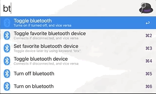

# Alfred Workflow: Bluetooth Controller
A powerful toolkit for managing your bluetooth connections.

## Installation

### Summary
Install [blueutil](http://www.frederikseiffert.de/blueutil/) and [Alfred workflow](https://github.com/vegardinho/alfred_bluetooth_controller/releases/tag/1.4.1)!

### Instructions
1. Install [blueutil](http://www.frederikseiffert.de/blueutil/): 

Using package manager [Homebrew](https://brew.sh/):

```sh
# install
brew install blueutil

# update
brew update
brew upgrade blueutil

# uninstall
brew remove blueutil
```

Using package manager [MacPorts](https://www.macports.org/):

```sh
# install
port install blueutil

# update
port selfupdate
port upgrade blueutil

# uninstall
port uninstall blueutil
```

2. Download the [Alfred workflow](https://github.com/vegardinho/alfred_bluetooth_controller/releases/tag/1.4.1) and double-click to install!


## Usage



### Manage bluetooth
- Toggle bluetooth on and off: `bt`
- Turn bluetooth on: `bton`
- Turn bluetooth off: `btoff`

### Toggle device connections
- Connect/disconnect from device: `btd` + `device name`
- By typing an argument, the workflow will automatically search through all devices prevously paired with the computer.

### Manage favorite device
- Set favorite device: `btsetfavorite` + `device name`
- Toggle connection to favorite device: `btx`
